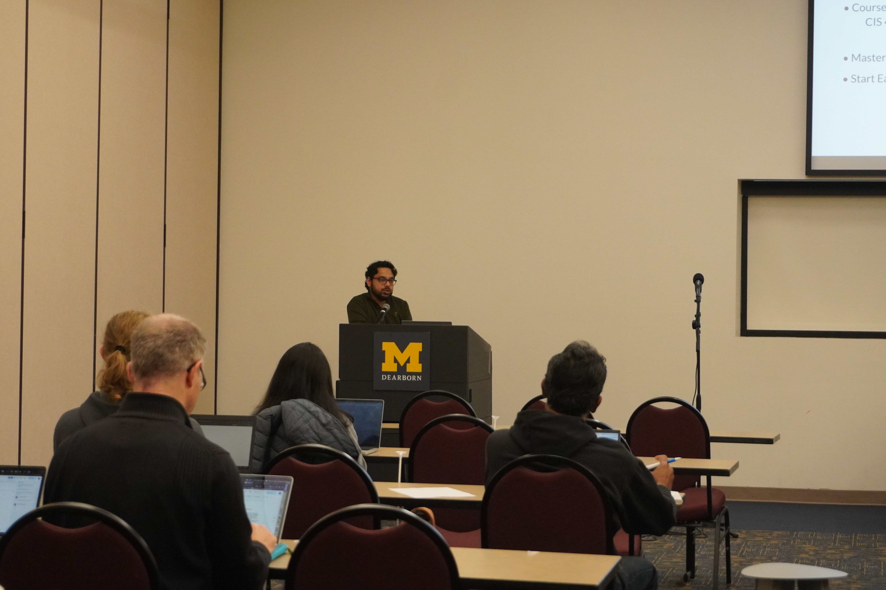
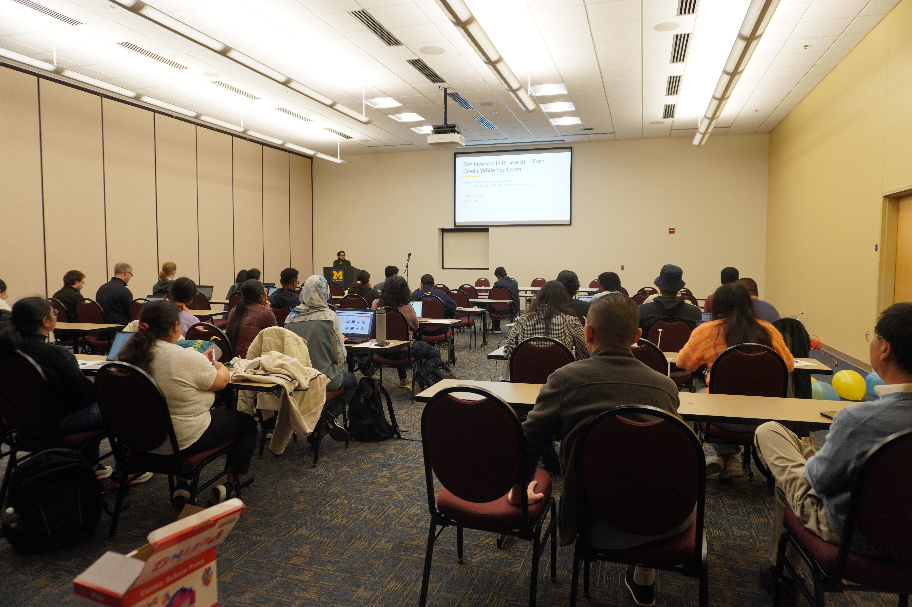
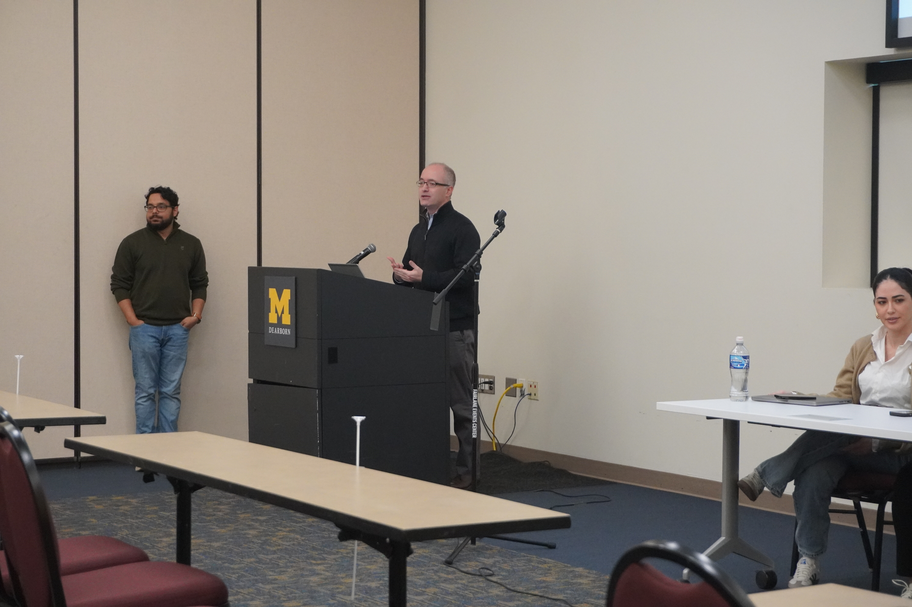
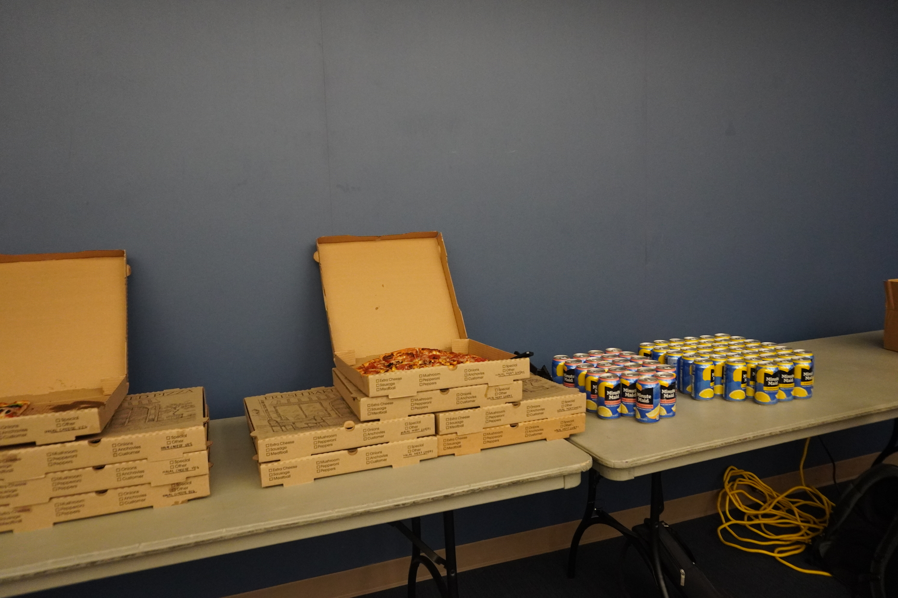
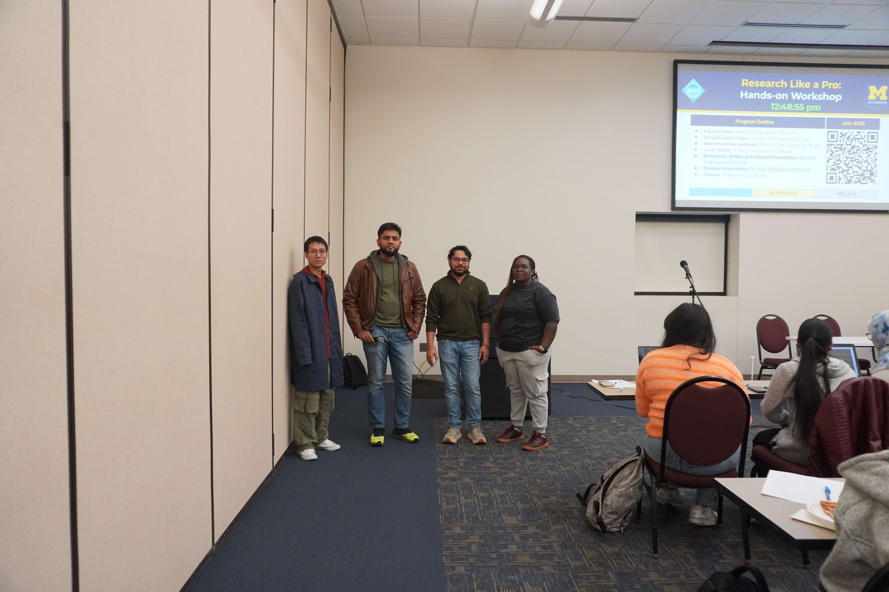
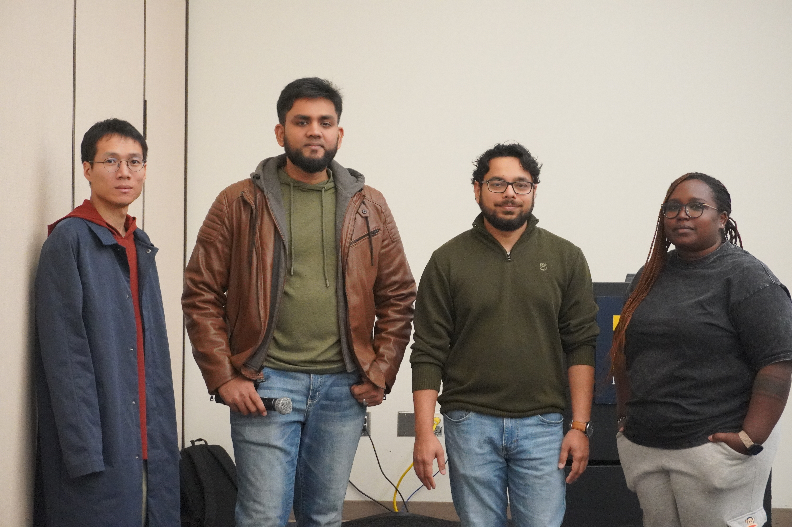
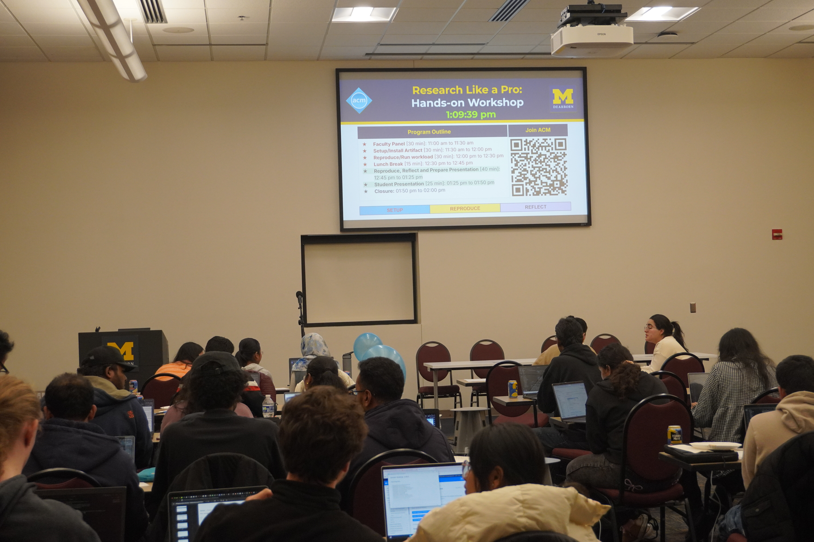
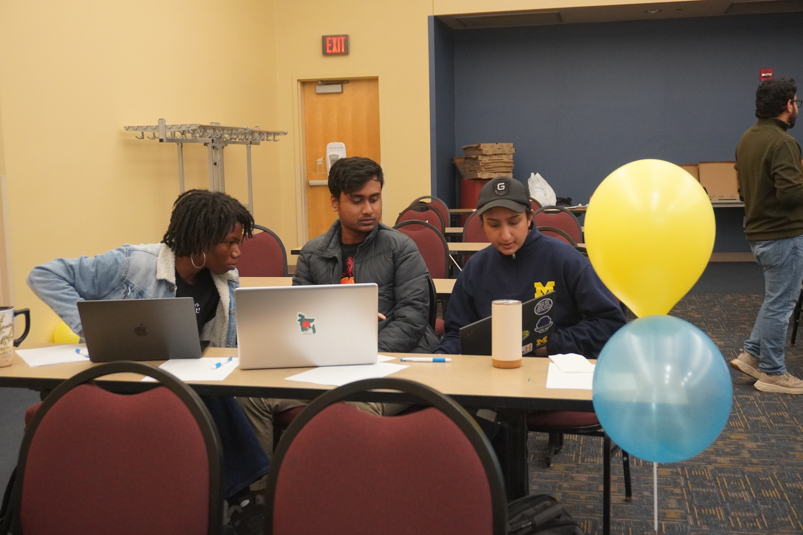

# 🎓 Research Like a Pro: Hands-on Workshop on Building Research Mindset and Skills through Reproducibility

**📅 Date:** **Friday, October 24 at 11 AM**  
**🏛 Hosted by:** CIS Department & ACM Student Chapter  

---

## 💡 Overview

Curious how researchers design experiments, validate results, and tackle complex problems?  
Join us for the **CIS Reproducibility Workshop** — a hands-on event where you’ll explore, experiment, and present your findings alongside peers and faculty.

This workshop helps you develop **critical thinking**, **collaboration**, and **research resilience** — the essential skills that define successful scholars and innovators.

---

## 🔹 What’s Inside

### 🎙 Faculty Panel (30 min)
Hear insights on research design, validation, and communication from:

- Dr. **Khouloud Gaaloul**  
- Dr. **Foyzul Hassan**  
- Dr. **Anwar Ghammam**  
- Dr. **Utkarshani Jaimini**  
- Dr. **Niccolò Meneghetti**  
- *Moderated by Dr. Probir Roy*

---

### 🧠 Hands-on Workshop (90–120 min)
Work in small groups to **reproduce and analyze selected results** from faculty-nominated research papers.  
Experience the challenges and creativity involved in **validating scientific results**.

---

### 🗣 Student Presentations (30–40 min)
Present your:
- Research problem of interest  
- Reproduced results and observations  
- Lessons learned during the process

---

## 🧩 Workshop Proposals & Tracks

Participants will work in small groups to reproduce results from one of the following faculty-nominated research papers.  
Each project provides hands-on experience with different aspects of reproducible research.

---

### 🔍 Proposal 1: ProRCA
**Proposed by:** Dr. Utkarshani Jaimini  
**Paper:** [ProRCA: A Causal Python Package for Actionable Root Cause Analysis in Real-world Business Scenarios](https://arxiv.org/pdf/2503.01475)  

**Skills You’ll Develop**
- Apply causal inference techniques in practice  
- Design reproducible pipelines and inject controlled anomalies  
- Interpret and validate causal results  

**Student Tasks**
- Investigate whether anomaly injection reveals true causal links  
- Evaluate how reproduced results align with the paper’s claims  
- Reflect on discrepancies and what they reveal about reproducibility  

**Resources**
- [GitHub Repository](https://github.com/profitopsai/ProRCA)  
- [Documentation](https://prorca.readthedocs.io/en/latest/)  
- [DoWhy Library](https://www.pywhy.org/dowhy/v0.13/)

---

### ⚙️ Proposal 2: EvoSuite
**Proposed by:** Dr. Khouloud Gaaloul  
**Paper:** [EvoSuite: Automatic Test Suite Generation with Defects4J](https://www.evosuite.org/wp-content/papercite-data/pdf/esecfse11.pdf)  

**Skills You’ll Develop**
- Use automated test generation tools  
- Measure coverage and mutation metrics  
- Benchmark test effectiveness  

**Student Tasks**
- Compare EvoSuite and Randoop test quality  
- Evaluate coverage and mutation scores  
- Reflect on tool differences and reproducibility  

**Resources**
- [Documentation](https://www.evosuite.org/documentation/)  
- [GitHub Repository](https://github.com/EvoSuite/evosuite/releases/tag/v1.1.0)

---

### 🤖 Proposal 3: Quality Assessment of ChatGPT-Generated Code
**Proposed by:** Dr. Anwar Ghammam  
**Paper:** [Quality Assessment of ChatGPT-Generated Code and their Use by Developers](https://s2e-lab.github.io/preprints/msr_mining_challenge24-preprint.pdf)  

**Skills You’ll Develop**
- Run static analysis tools (Pylint, Bandit, CodeQL)  
- Interpret software quality metrics  
- Conduct empirical software engineering  

**Student Tasks**
- Investigate systematic issues in ChatGPT-generated code  
- Evaluate static analysis findings across languages  
- Reflect on differences from the paper’s conclusions  

**Resources**
- [GitHub Repository](https://github.com/s2e-lab/DevGPT-Study)  
- [Python Downloads](https://www.python.org/downloads/)

---

### 🧠 Proposal 4: SpecRover
**Proposed by:** Dr. Foyzul Hassan  
**Paper:** [SpecRover: Code Intent Extraction via LLMs](https://dl.acm.org/doi/10.1109/ICSE55347.2025.00080)  

**Skills You’ll Develop**
- Orchestrate multi-agent LLM workflows  
- Infer code intent using SWE-bench datasets  
- Extend experimental pipelines  

**Student Tasks**
- Investigate whether multi-agent systems infer developer intent  
- Evaluate generated patch performance  
- Reflect on challenges in scaling LLM-based repair  

**Resources**
- [Artifacts](https://zenodo.org/records/13161651)  
- [GitHub Repository](https://github.com/AutoCodeRoverSG/auto-code-rover)

---

### 🧪 Proposal 5: InfiniFilter
**Proposed by:** Dr. Niccolò Meneghetti  
**Paper:** [InfiniFilter: Expanding Filters to Infinity and Beyond](https://dl.acm.org/doi/10.1145/3589285)  

**Skills You’ll Develop**
- Debug and configure research environments  
- Reproduce algorithmic benchmarks  
- Analyze reproducibility trade-offs in data systems  

**Student Tasks**
- Investigate reproducibility of InfiniFilter results on modern hardware  
- Evaluate reproduced plots vs. originals  
- Reflect on environmental effects on reproducibility  

---

## 🌍 Open to Everyone

This workshop welcomes **all students, faculty, and research enthusiasts** — regardless of background or experience.  
If you’re curious about how research works, this is your chance to **learn by doing** and connect with the CIS research community.

---

## 📬 Contact
For questions, please reach out to the **CIS ACM Student Chapter**  
📧 [acm@umdearborn.edu](mailto:acm@umdearborn.edu)

---

### ⭐ Join Us
Don’t just read about research — **do it!**  
Let’s build a culture of openness, rigor, and reproducibility in CIS research together.  

<a href="https://forms.gle/pXo2RDwSNbaMPp898" target="_blank" style="background-color:#00274C;color:#FFCB05;padding:12px 24px;text-decoration:none;font-weight:bold;border-radius:8px;display:inline-block;">
📝 RSVP Here to Reserve Your Spot
</a>

  

📍 **Friday, October 24 at 11 AM**  
💬 *Open to everyone — come and explore the world of reproducible research!*

## 🏆 Workshop Results & Highlights

We’re excited to announce the **top three teams** from the *Research Like a Pro: Hands-on Workshop on Building Research Mindset and Skills through Reproducibility*, hosted by the **ACM Student Chapter** and the **CIS Department at the University of Michigan–Dearborn**!

After careful evaluation by our **faculty panel**, based on the quality of analysis, reproducibility of results, and clarity of presentation, the final results are:

### 🥇 1st Place — Team 3C  
**Members:** Mohammad Opal, Hadiza Yusuf, Ahmad Jayeb  

### 🥈 2nd Place — Team 5A  
**Member:** Raymond DiDonato  

### 🥉 3rd Place — Team 4A  
**Members:** Avishak Chakroborty, Javid Ditty, Sudarshan Sridhar  

Congratulations to all our winners for their hard work, creativity, and research excellence! 🎓  
Each team demonstrated outstanding collaboration and critical thinking throughout the workshop.

📝 *If you notice any missing or misspelled team member names, please contact us as soon as possible at [acm@umdearborn.edu](mailto:acm@umdearborn.edu) so we can update the results promptly.*

---

### 📸 Event Photo Highlights

Below are some of our favorite moments from the workshop — capturing collaboration, discussion, and discovery in action!

---

📍 *Hosted by the ACM Student Chapter and CIS Department, University of Michigan–Dearborn.*  
🔗 [Return to Event Page](https://acm-umdearborn.github.io/2025-10-24-acm-umdearborn-workshop/)

